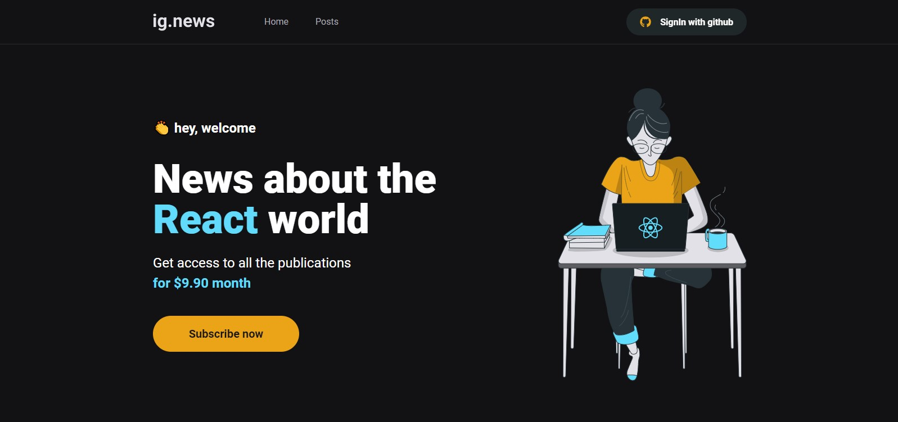

# Ignews

A newsletter about React made with NextJS.


## Technologies

 - [NextJS](https://nextjs.org)
 - [Sass](https://sass-lang.com)
 - [Next-Auth](https://next-auth.js.org)
 - [FaunaDB](https://fauna.com)
 - [Stripe](https://stripe.com/br)
 - [Prismic CMS](https://prismic.io)

  
## Run Locally

Clone the project

```bash
  git clone https://github.com/acferM/ignews
```

Go to the project directory

```bash
  cd my-project
```

Install dependencies

```bash
  npm install
```

or

```bash
  npm install
```

Start the app

```bash
  npm run dev
```

or

```bash
  yarn dev
```

## Environment Variables

To run this project, you will need to add the following environment variables to your .env.local file

```env
# Stripe

STRIPE_API_KEY=YOUR_STRIPE_API_KEY
NEXT_PUBLIC_STRIPE_PUBLIC_KEY=YOUR_STRIPE_PUBLIC_KEY
STRIPE_WEBHOOK_SECRET=YOUR_STRIPE_WEBOOK_KEY
STRIPE_SUCCESS_URL=http://localhost:3000/posts
STRIPE_CANCEL_URL=http://localhost:3000/

# Github

GITHUB_CLIENT_ID=CLIENT_ID_TO_YOUR_GITHUB_APP
GITHUB_CLIENT_SECRET=SECRET_TO_YOUR_GITHUB_APP

# FaunaDB

FAUNADB_KEY=YOUR_SECRET_FAUNADB_KEY

# Pismic CMS

PRISMIC_ENDPOINT=LINK_TO_PRISMIC_ENDPOINT
PRISMIC_ACCESS_TOKEN=YOUR_PRISMIC_TOKEN
```
  ## App Colors

| Color             | Hex                                                                |
| ----------------- | ------------------------------------------------------------------ |
| White |  #ffffff |
| Gray-100 |  #e1e1e6 |
| Gray-300 |  #a8a8b3 |
| Gray-700 |  #323238 |
| Gray-800 |  #29292e |
| Gray-850 |  #1f2729 |
| Gray-900 |  #121214 |
| Cyan-500 |  #61dafb |
| Yellow-500 |  #eba417 |

## Screenshots


